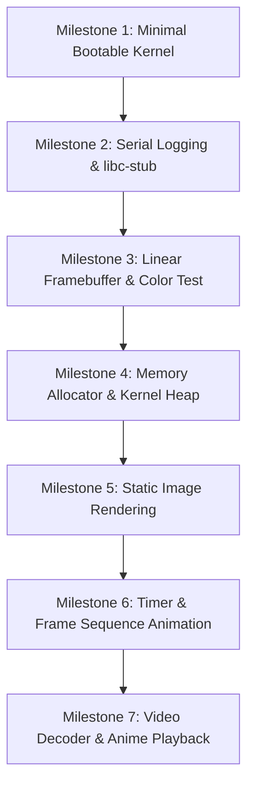

# AnimeOS: Architecture Plan & Development Roadmap

## 1. Environment & Diagnostic Analysis

### System Environment
* **Host Operating System:** Microsoft Windows 11 Pro (64-bit, Version 10.0.26200)
* **Host CPU Architecture:** x86_64 (64-bit Intel/AMD architecture)
* **Project Directory:** `D:\AnimeOS` (Currently clean / 0 existing files)

### A. Tools Currently Installed
* **Build System:** CMake `v4.4.0` (`C:\Program Files\CMake\bin\cmake.exe`)
* **Version Control:** Git `v2.53.0` (`C:\Program Files\Git\cmd\git.exe`)
* **Windows Package Manager:** Winget `v1.29.280` (`winget.exe`)

### B. Tools Missing for Bare-Metal OS Development
To build, assemble, link, and test an x86_64 bare-metal kernel on Windows, the following core toolchain components are currently missing:
1. **C/C++ Compiler:** Clang / GCC target cross-compiler (`clang` or `x86_64-elf-gcc`).
2. **Assembler:** NASM (`nasm.exe`).
3. **Linker & Utilities:** LLVM Linker (`lld.exe`) and LLVM binutils (`llvm-ar`, `llvm-objcopy`).
4. **Emulator / Virtual Machine:** QEMU (`qemu-system-x86_64.exe`).

---

## 2. Toolchain & Boot Strategy Recommendations

### C. Recommended Toolchain: LLVM/Clang + lld + NASM + QEMU
* **Why LLVM/Clang instead of GCC on Windows?**
  * **Native Target Support:** `clang` natively supports cross-compiling for bare-metal targets using `-target x86_64-unknown-none-elf -ffreestanding -nostdlib` without needing to build a custom `x86_64-elf-gcc` cross-compiler binary.
  * **Unified Windows Toolchain:** `clang` and `lld` run natively in PowerShell and integrate directly with CMake on Windows.
  * **Modern LTO & SIMD:** LLVM provides excellent auto-vectorization (SSE2/AVX2), which will be critical when we implement software video decoding.

### D. Recommended Boot Path: Modern UEFI (x86_64)
* **Why UEFI over Legacy BIOS?**
  * **64-bit Long Mode Hand-off:** Legacy BIOS starts the CPU in 16-bit Real Mode, requiring custom assembly routines to transition through 32-bit Protected Mode into 64-bit Long Mode. UEFI firmware starts natively in 64-bit mode on modern x86_64 CPUs.
  * **Graphics Output Protocol (GOP):** UEFI provides GOP, which allows setting up high-resolution linear framebuffers (e.g. 1920x1080 ARGB8888) cleanly before kernel entry. Legacy VBE (VESA BIOS Extensions) is rigid and unavailable on modern hardware.

### E. Recommended Bootloader: Limine Bootloader
* **Why an existing minimal bootloader instead of writing a bootloader from scratch?**
  * Writing a custom bootloader from scratch requires hundreds of hours of low-level 16-bit assembly, disk drivers, GDT/IDT setups, and manual GOP/VBE initialization before writing a single line of kernel graphics code.
  * **Limine** is an open-source, ultra-lightweight modern bootloader designed specifically for OS development. It supports UEFI and BIOS, handles CPU setup, and delivers a clean struct containing the **Linear Framebuffer (LFB)** address, width, height, pitch, and pixel format directly to our C/C++ kernel entry point.

---

## 3. System Architecture

AnimeOS is designed as a **monolithic educational micro-kernel** optimized for high-performance linear framebuffer graphics rendering and video processing.

```
+-------------------------------------------------------------------+
|                       Anime Dance Video Asset                     |
+-------------------------------------------------------------------+
|                 Media Engine & Video Decoder Layer                |
|       (MP4 ISOBMFF Demuxer / H.264 or Lightweight RLE Codec)       |
+-------------------------------------------------------------------+
|                     Software Graphics Pipeline                    |
|       (Double Buffering / Software Blitter / Image Parsers)       |
+-------------------------------------------------------------------+
|                        Core Kernel Services                       |
|   (Kprintf Serial / Physical Mem / Kernel Heap / PIT-APIC Timers)  |
+-------------------------------------------------------------------+
|                     Limine UEFI Bootloader                        |
+-------------------------------------------------------------------+
|                        x86_64 QEMU / Hardware                     |
+-------------------------------------------------------------------+
```

### Core Architecture Layers:
1. **Boot & Entry Layer:**
   * Receives memory map and framebuffer pointer from Limine via boot protocol header.
   * Disables firmware services and takes exclusive control of hardware.
2. **Kernel Core Subsystems:**
   * **Serial Console (`kprintf`):** Outputs debug logs to UART COM1 (`0x3F8`) for QEMU console debugging.
   * **Physical Memory Allocator (PMM):** Manages free 4KB memory pages from the UEFI memory map.
   * **Virtual Memory (Paging):** Maps physical RAM and linear framebuffer memory.
   * **Kernel Heap (`kmalloc` / `kfree`):** Provides dynamic memory allocation needed by video frame buffers and decoders.
   * **Timer Subsystem:** PIT (Programmable Interval Timer) or APIC Timer to maintain strict 24/30 FPS frame timing.
3. **Graphics Subsystem:**
   * **Linear Framebuffer (LFB):** Direct write access to 32-bit ARGB pixels.
   * **Double Buffering System:** Off-screen RAM buffer where frames are rendered, then copied to video RAM using fast `memcpy` / SIMD to eliminate screen tearing.
4. **Media Engine Subsystem:**
   * **Ramdisk Asset Manager:** Reads embedded raw data assets from RAM.
   * **Frame / Video Decoder:** Decodes raw/compressed video frames directly into the double buffer.

---

## 4. Incremental Milestone Roadmap

Each milestone has an explicit **Success Criterion** and MUST be fully built, executed, and verified in QEMU before proceeding to the next step.



### Milestone 1: Minimal Bootable Kernel [COMPLETED]
* **Goal:** Create a minimal C kernel binary linked with Limine boot headers, packaged into a bootable ISO/disk image.
* **Deliverables:** `CMakeLists.txt`, `linker.ld`, `src/kernel.c`, `include/limine.h`, `boot/BOOTX64.EFI`, `boot/limine.conf`.
* **Success Criterion:** QEMU boots AnimeOS via UEFI, hits `kernel_main`, prints diagnostic output via COM1 UART (`0x3F8`), and halts cleanly without crashing.

### Milestone 2: Serial Logging & Freestanding C Library Stub
* **Goal:** Implement serial port UART driver (`0x3F8`) for debugging, along with core C library memory routines (`memcpy`, `memset`, `memcmp`, `strlen`).
* **Deliverables:** `kprintf` function and serial logging infrastructure.
* **Success Criterion:** QEMU output stream prints formatted diagnostic string: `[AnimeOS] Boot successful! System running in 64-bit Long Mode.`

### Milestone 3: Linear Framebuffer Graphics & Screen Fill
* **Goal:** Retrieve GOP framebuffer protocol structure from Limine and draw primitive shapes and background fills.
* **Deliverables:** `framebuffer.c` module (pixel drawing, screen clearing, RGB color fills).
* **Success Criterion:** QEMU window displays a fullscreen solid color (Anime Pink `#FF69B4`) at native resolution.

### Milestone 4: Physical Memory Allocator & Kernel Heap (`kmalloc`)
* **Goal:** Parse UEFI memory map to build a Physical Page Allocator (Bitmap/Buddy) and implement dynamic kernel heap (`kmalloc`/`kfree`).
* **Deliverables:** `pmm.c` and `heap.c` allocators.
* **Success Criterion:** Kernel can dynamically allocate arbitrary memory buffers (e.g. 8 MB back-buffer for double buffering) without static array limitations.

### Milestone 5: Static Image Rendering
* **Goal:** Render a static high-resolution anime illustration onto the screen using a double buffer to prevent flickering.
* **Deliverables:** Image decoder / raw bitmap blitter (`draw_image()`).
* **Success Criterion:** A crisp anime wallpaper renders fullscreen in QEMU with accurate color depth and zero distortion.

### Milestone 6: High-Precision Hardware Timer & Frame Animation
* **Goal:** Initialize PIT / APIC timer interrupts to establish a steady frame tick (e.g. 30 FPS). Cycle through a sequence of uncompressed / RLE-compressed anime frames stored in a RAM disk.
* **Deliverables:** Hardware timer driver and animated frame blitter.
* **Success Criterion:** Anime animation plays smoothly in QEMU at a stable 30 FPS without screen tearing.

### Milestone 7: Software Video Decoder & Anime Video Playback
* **Goal:** Integrate a lightweight bare-metal video decoder (e.g. Motion JPEG or software H.264 baseline / MP4 parser) to stream and play the final anime dance video.
* **Deliverables:** MP4 demuxer, frame decoder pipeline, and video player loop.
* **Success Criterion:** Fullscreen anime dance video plays from start to finish on bare-metal QEMU at target frame rate.

---

## 5. Major Technical Challenges in Bare-Metal Video Playback

Executing video playback in a bare-metal environment introduces several major engineering challenges:

1. **Absence of Host Operating System APIs:**
   * Bare-metal systems have no POSIX library, no file system APIs (`fopen`, `fread`), no threading libraries (`pthread`), and no standard C library (`malloc`, `printf`). Every subsystem must be built from first principles.
2. **Software Video Decoding (No GPU Acceleration):**
   * Without vendor graphics drivers (NVIDIA/AMD/Intel PCIe drivers), GPU video acceleration (NVDEC, VA-API, DXVA) is unavailable. All video frame decoding must be performed 100% on the CPU.
3. **Complex Codec Mathematics (H.264 / AVC):**
   * Full H.264 playback requires parsing NAL units, entropy decoding (CAVLC/CABAC), inverse discrete cosine transforms (IDCT), motion vector prediction, and deblocking filters.
   * *Mitigation Strategy:* Start with raw/RLE or Motion JPEG (MJPEG) frame sequences before escalating to full software H.264 decoding.
4. **MP4 Container Parsing (ISOBMFF):**
   * Parsing MP4 files requires navigating nested atom/box hierarchies (`ftyp`, `moov`, `mdat`, `trak`, `stbl`, `stts`, `stsc`) directly from memory or disk without OS file system helpers.
5. **Memory Footprint & Allocation Speed:**
   * High-definition video frames (1080p RGB32 = ~8.3 MB per uncompressed frame) require efficient heap management and SIMD-accelerated memory copy operations (`memcpy` via SSE2/AVX2).
6. **Frame Timing & Pacing:**
   * Without OS vsync or high-level timer loops, frame timing relies on hardware interrupt handlers (PIT/APIC) to maintain exact playback speed without drift.

---

## 6. Next Steps & Prerequisites

Before writing any code for **Milestone 1**, the required host development tools must be installed on Windows. 

### Required Installations (via Winget):
```powershell
# Recommended command to install missing development tools:
winget install --id LLVM.LLVM -e
winget install --id NASM.NASM -e
winget install --id SoftwareFreedomConservancy.QEMU -e
```

*Status: Awaiting user confirmation to install prerequisite tools before starting Milestone 1 implementation.*
